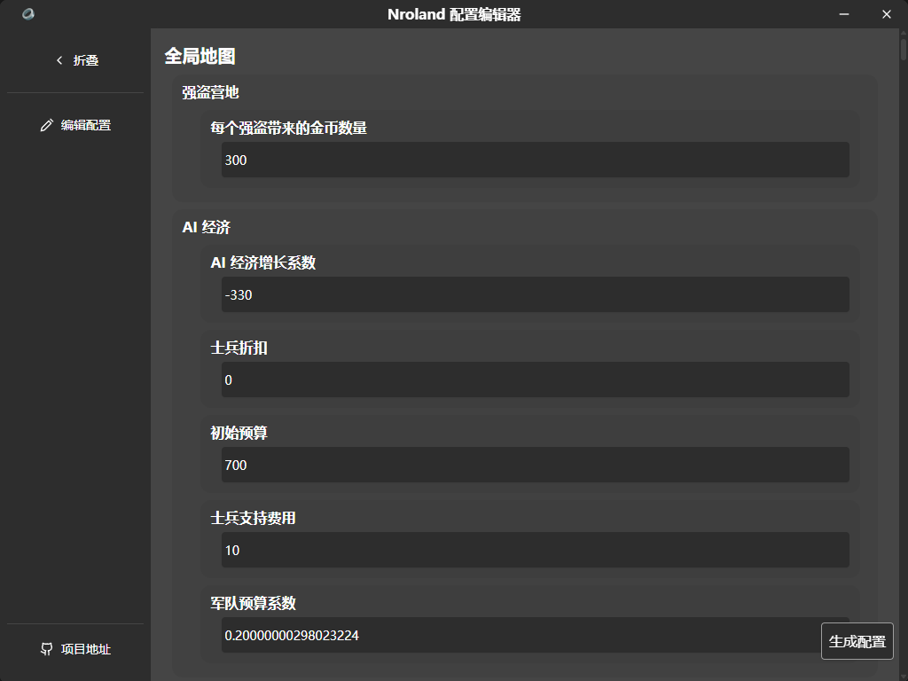

# Norland 配置编辑器

## 介绍

一个可以可视化编辑[《Norland》](https://store.steampowered.com/app/1857090/Norland/)游戏配置的工具

将生成的配置复制到游戏目录下的 `gameplay_variables.json` 中




### 构建


```console
cd frontend
```

```console
npm install
```

```
cd ..
```

```console
wails build
```
